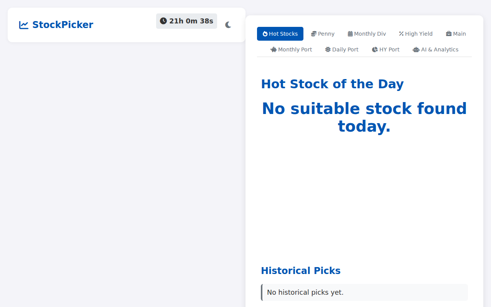
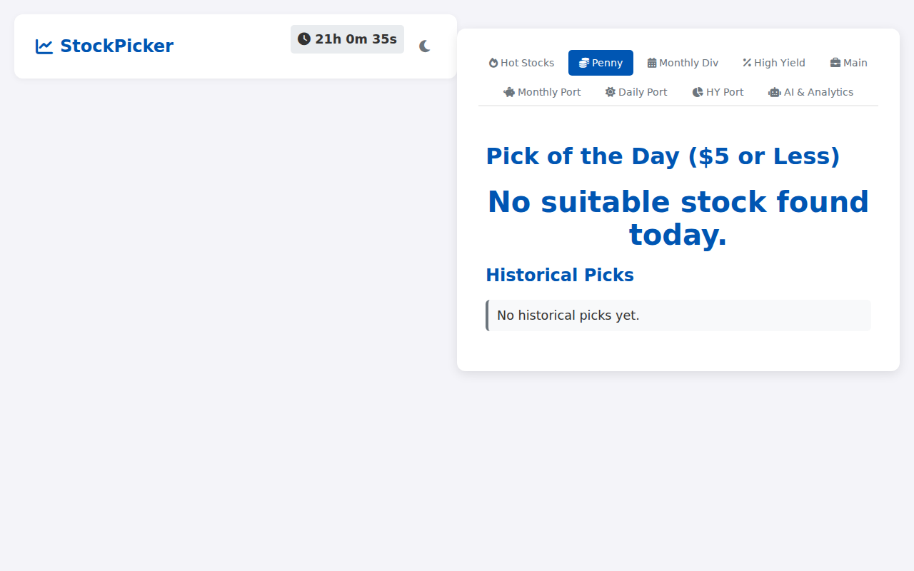
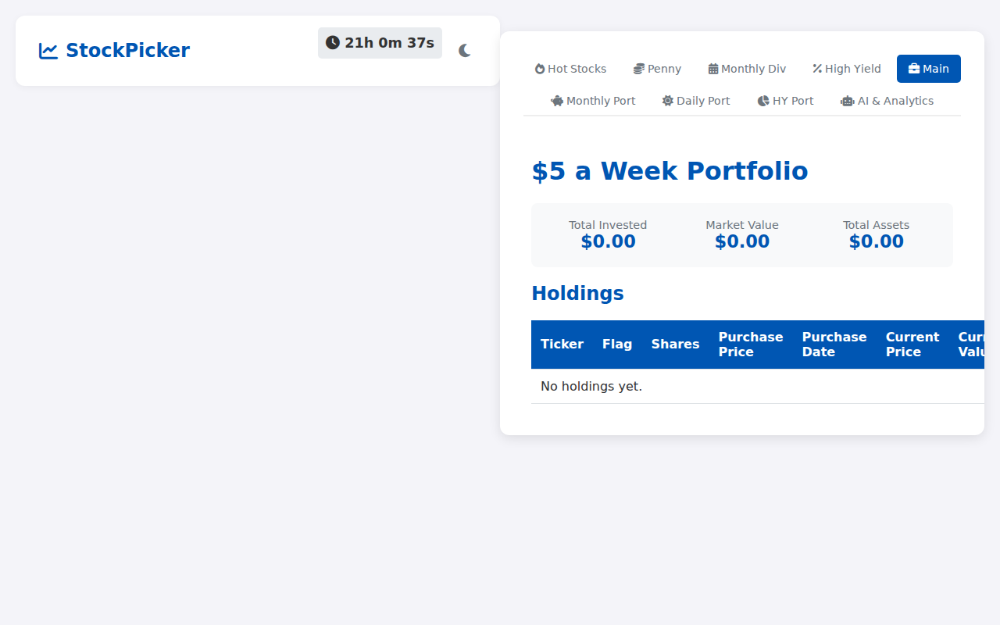
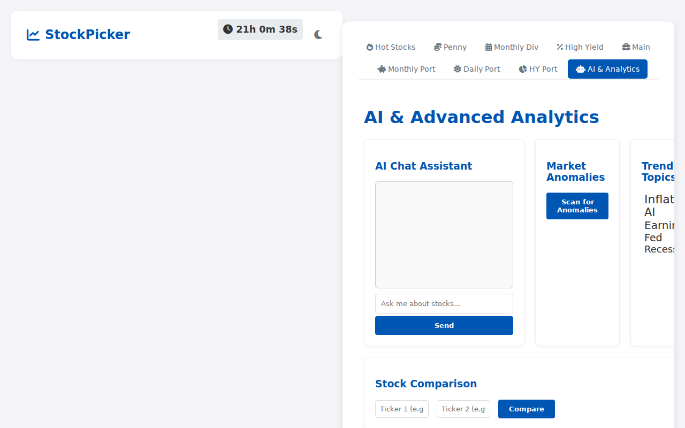
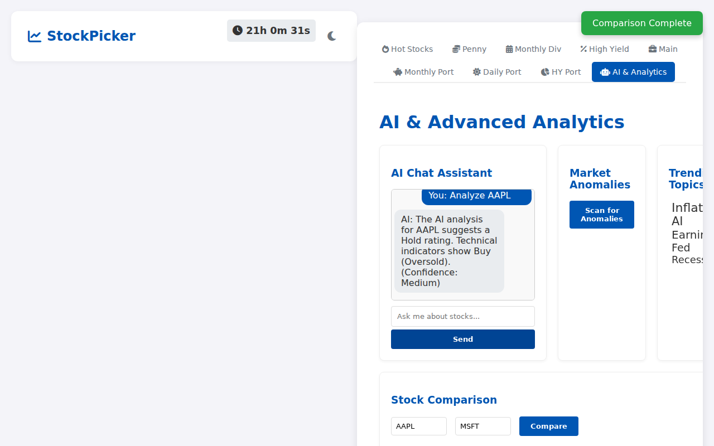
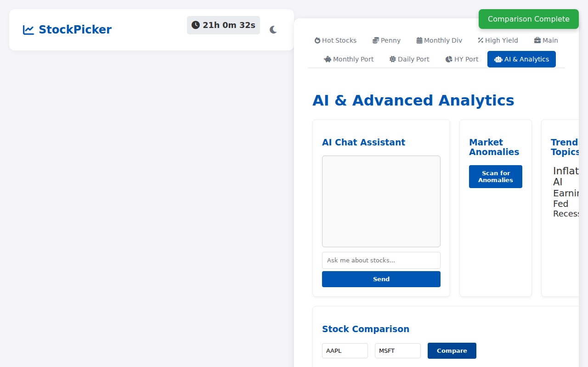
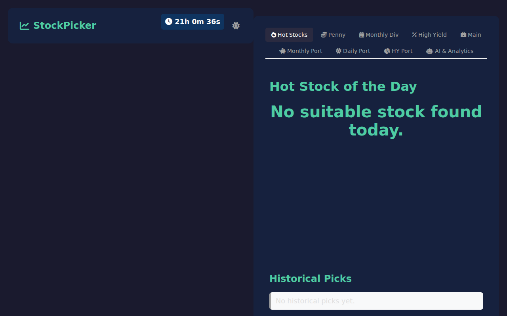
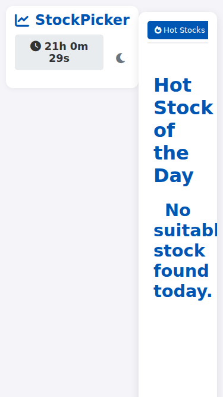

# User Guide: Stock Picker App

Welcome to the Stock Picker App! This guide will help you navigate the features and make the most of your investment tools.

## Table of Contents
1. [Overview](#1-overview)
2. [The Dashboard](#2-the-dashboard)
3. [Discovering Stocks](#3-discovering-stocks)
4. [Portfolio Tracking](#4-portfolio-tracking)
5. [Beta Features (AI & Tools)](#5-beta-features-ai--tools)
6. [Settings](#6-settings)

---

## 1. Overview
The Stock Picker App is a daily companion for investors. It automatically scans the market to find:
- **Hot Stocks**: S&P 500 companies showing strong growth.
- **Penny Stocks**: Affordable stocks with momentum.
- **Dividend Stocks**: Reliable income-generating assets.

It also helps you track simulated portfolios and uses AI to analyze market trends.

---

## 2. The Dashboard
When you open the application, you will see the **Main Dashboard**.

### Navigation Bar
At the top of the screen:
- **Timer**: Shows how long until the next daily stock pick is released.
- **Dark Mode**: Click the Moon/Sun icon to toggle between light and dark themes.

### Tabs
The main interface is divided into tabs:
- **Hot Stocks** (Default)
- **Penny Stocks**
- **Monthly Dividend**
- **High Yield**
- **Portfolios** (Main, Monthly, Daily, High Yield)
- **AI & Analytics**

---

## 3. Discovering Stocks
Click on any of the first four tabs to see the **Pick of the Day**.

### How to Read a Pick
- **The Ticker**: Displayed in large text (e.g., `AAPL`). Click it to open the Yahoo Finance page for that stock.
- **Sentiment Star (★)**: If you see a green star, it means recent news sentiment for this stock is highly positive.
- **Chart**: A price history chart appears below the ticker to show recent performance.
- **History**: A list of past picks is displayed below, allowing you to track how previous recommendations have performed.

---

## 4. Portfolio Tracking
The app tracks four simulated portfolios. Click on a **Portfolio Tab** (e.g., "$5 Portfolio") to view details.

### Summary Cards
- **Total Invested**: The amount of cash put into the portfolio.
- **Market Value**: The current value of all holdings.
- **Total Assets**: Cash Balance + Market Value.

### Holdings Table
A detailed list of stocks currently owned:
- **Ticker**: The stock symbol.
- **Flag**: A red dot (●) indicates a "Sell Warning" based on negative news sentiment.
- **Current Value**:
  - **Green**: Profit.
  - **Red**: Loss.

---

## 5. AI & Analytics Tools
Click the **AI & Analytics** tab to access advanced tools.

### AI Chat Assistant
Ask questions about the market!
- **Try asking**: *"Analyze AAPL"* or *"Price of MSFT"* or *"Risk for TSLA"*.
- The AI will respond with technical indicators and a trade thesis.

### Market Anomalies
Click **"Scan for Anomalies"** to find stocks behaving unusually (e.g., sudden volume spikes or price drops). This is great for finding breakout candidates.

### Stock Comparison
Compare two stocks side-by-side.
1. Enter the first ticker (e.g., `NVDA`).
2. Enter the second ticker (e.g., `AMD`).
3. Click **Compare**.
4. View metrics like **PE Ratio**, **Beta** (Volatility), and **Price**.

### Trending Topics
A word cloud shows you what topics are currently dominating financial news (e.g., "Inflation", "Fed", "Earnings").

---

## 6. Settings
- **Dark Mode**: Use the toggle in the top-right corner to switch to a dark theme for comfortable night viewing.

- **Mobile View**: The app is fully responsive and works great on your phone or tablet.

